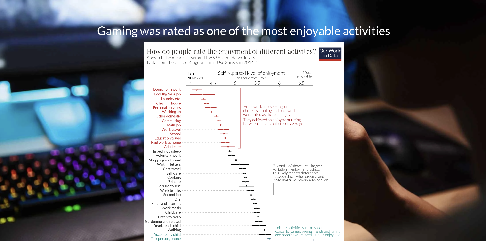

# Final project Writeup

## Part III

### Storyboard Design

The story starts with a box plot on people's rating of enjoyment of different activities. Gaming was once a very popular leisure activity. I added this section in Part III because based on the feedback I received, some interviwees thought the purpose of the story was to analyze the gaming market. 

Then I used graphs on video game sales to show gaming was gradually losing popularity, and people are now spending more time on other entertainments. I chose line graph for this secion because I wanted to show a shrinking trend. 

I closed with a bubble chart on how people spend their leisure time now and a paragraph for call to action. 

In my original design, I hardly used any texts in the story. When implementing it, I find it's very helpful to use texts to point out important area in the graph and guide people through the story.

In terms of colors and the design of the story board, setting a general theme in color really made it easier to choose what colors to use in visualiations and what images to use as background. I also used text over media for most of the story since I'm relying heavily on visualzations rather than texts.

### Target audience
My intended audience is people who wants to learn about trends in leisure activities. For instance, people working in the advertising industry might like to know how people spend their leisure time to decide advertising platforms (TV, social media, or gaming, etc.).

### Final Data Story
[https://carnegiemellon.shorthandstories.com/shuxuanl/index.html](https://carnegiemellon.shorthandstories.com/shuxuanl/index.html)

### GitHub Repository
[https://github.com/LaylalaLau/Shuxuan-Liu-Portfolio](https://github.com/LaylalaLau/Shuxuan-Liu-Portfolio)

### References

##### Dataset:

Video games sales - dataset by sumitrock. data.world. (2019, December 29). Retrieved September 26, 2022, from https://data.world/sumitrock/video-games-sales 

##### Images:

Ali, H. (2022, May 13). Pakistani gamers want a seat at the table. Wired. Retrieved October 8, 2022, from https://www.wired.com/story/pakistan-gamers-sadia-bashir/

How games earn? A complete case study on gaming industry. Lapaas. (2021, November 21). Retrieved October 9, 2022, from https://lapaas.com/how-games-earn/

Ortiz-Ospina, E. (2020, December 8). How do people across the world spend their time and what does this tell us about living conditions? Our World in Data. Retrieved October 9, 2022, from https://ourworldindata.org/time-use-living-conditions#:~:text=We%20see%20that%20the%20most,games%20or%20attending%20cultural%20performances.

Desktop Game HD wallpapers on WallpaperDog. on WallpaperDog. (n.d.). Retrieved October 9, 2022, from https://wallpaper.dog/desktop-game-hd-wallpapers

Unsplash. (n.d.). 1000+ dark background music pictures: Download free images on unsplash. 1000+ Dark Background Music Pictures | Download Free Images on Unsplash. Retrieved October 9, 2022, from https://unsplash.com/s/photos/dark-background-music

Leisure time concept clock closeup isolated on white background with red and black words. 123RF. (n.d.). Retrieved October 9, 2022, from https://www.123rf.com/photo_12727901_leisure-time-concept-clock-closeup-isolated-on-white-background-with-red-and-black-words.html

Cummins, E. (2021, July 28). 5 graphs that reveal how Americans spend their free time. Popular Science. Retrieved October 9, 2022, from https://www.popsci.com/health/how-americans-spend-free-time/

Texts：

https://www.musicalmum.com/types-of-entertainment/

U.S. Bureau of Labor Statistics. (n.d.). Men spent 5.6 hours per day in leisure and sports activities, women 4.9 hours, in 2021. U.S. Bureau of Labor Statistics. Retrieved October 9, 2022, from https://www.bls.gov/opub/ted/2022/men-spent-5-6-hours-per-day-in-leisure-and-sports-activities-women-4-9-hours-in-2021.htm#:~:text=On%20an%20average%20day%20in,did%20women%20(4.9%20hours).

Lin, Y. (n.d.). How much time does the average person spend on social media? Oberlo. Retrieved October 9, 2022, from https://www.oberlo.com/statistics/how-much-time-does-the-average-person-spend-on-social-media#:~:text=your%20free%20trial-,Average%20time%20spent%20on%20social%20media,also%20the%20highest%20ever%20recorded.

[Return to Homepage](/README.md)
