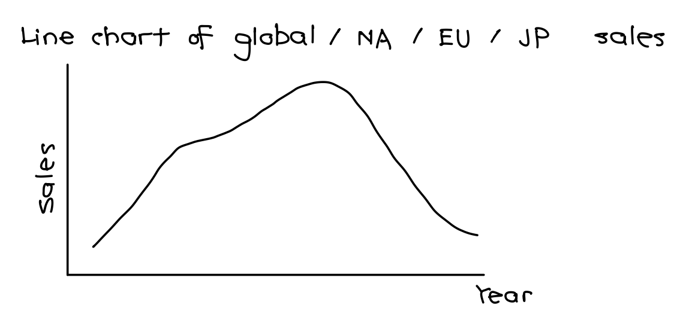
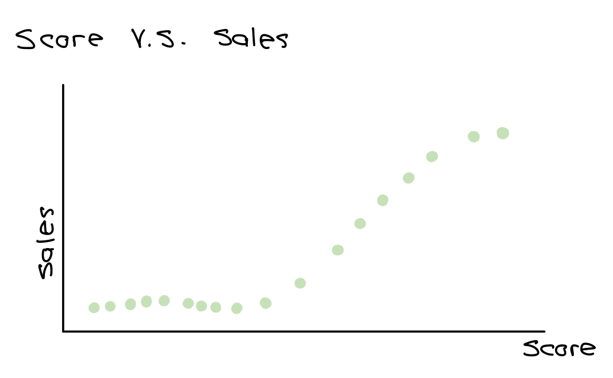
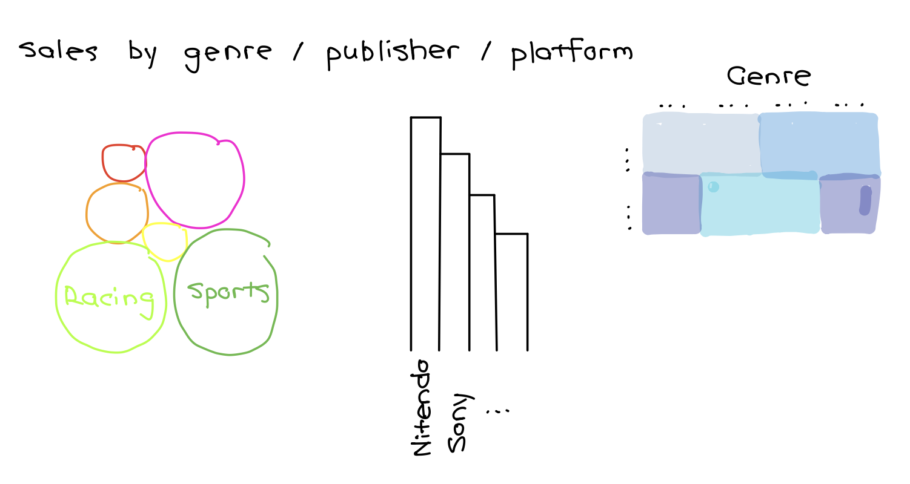
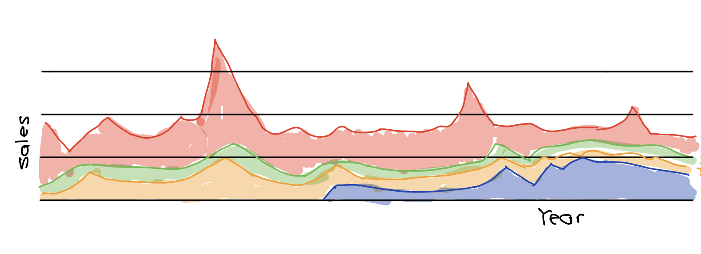
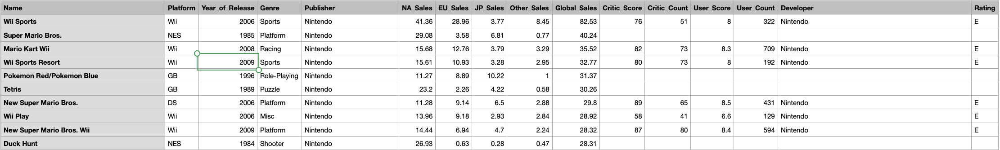

# Final project Overview

## Part I

### Outline 

I spend much of my free time playing video games on Switch and PS5 with my friends. Therefore, for this project, I intend to study and visualize data about video games. 

Gaming has evolved to become a multibillion-dollar market today. In my project, I would visualize the trend of global/regional video game sales (line chart), correlation of video game score and sales (scatter plot), and how much of total sales games from each genre/platform/publisher makes up (bar chart, pie chart, stacked area graph, bubble chart, heatmaps, etc.). I hope the audience can have a better sense of how the gaming market evolves, and what games are most popular after reading my story. I also hope to discover some good games as well ^_^

### Initial Sketches

I will use a line chart to show trend in global/regional video game sales. The header will be "Global/Regional Video Game Sales in Millions". The x-axis is year and the y-axis is sales.

I will use a scatter plot to draw the correlation of video game score and sales. The header will be "Video Game Score V.S. Sales". The x-axis is score and the y-axis is sales. There are two sets of scores (critic score and user score) for each game. I will use yellow points to represent user score, green points to represent critic score.

th
The next visualization is on the proportion of total sales games from each genre/platform/publisher makes up. The header will include the most popular genre/platform/publisher. I can use a bubble chart, where the size of the bubble represents the proportion. A bar chart, pie chart or stacked area chart, where the length, proportion or area represents how much the category makes up in the total sales. I could also use a heat map, where the axises are genre/platform/publisher, and color of different saturation representing sales.

### Data

Source: https://data.world/sumitrock/video-games-sales

The data is from data.world. It contains the platform, year of release, genre, publisher, global/regional sales, and score of 16719 games. 

### Method and Medium
I will build the graphs and plots using Tableau and Flourish. The story will be built using Shorthand. It will consist of approximately three to five graphs.

### References
Video games sales - dataset by sumitrock. data.world. (2019, December 29). Retrieved September 26, 2022, from https://data.world/sumitrock/video-games-sales 

## Part II

### Wireframes and storyboards

<object data="Final Project.pdf" width="1000" height="1000" type='application/pdf'></object>

### Data Visulization Drafts

<noscript></noscript><object class='tableauViz'  style='display:none;'><param name='host_url' value='https%3A%2F%2Fpublic.tableau.com%2F' /> <param name='embed_code_version' value='3' /> <param name='site_root' value='' /><param name='name' value='VideoGameScoreVS_Sales&#47;Sheet1' /><param name='tabs' value='no' /><param name='toolbar' value='yes' /><param name='static_image' value='https:&#47;&#47;public.tableau.com&#47;static&#47;images&#47;Vi&#47;VideoGameScoreVS_Sales&#47;Sheet1&#47;1.png' /> <param name='animate_transition' value='yes' /><param name='display_static_image' value='yes' /><param name='display_spinner' value='yes' /><param name='display_overlay' value='yes' /><param name='display_count' value='yes' /><param name='language' value='en-US' /><param name='filter' value='publish=yes' /></object>
                

### User research and interviews

### Revised Wireframes and storyboards

### References

Video games sales - dataset by sumitrock. data.world. (2019, December 29). Retrieved September 26, 2022, from https://data.world/sumitrock/video-games-sales 

Perrin, A. (2020, May 30). Social Media Usage: 2005-2015. Pew Research Center: Internet, Science &amp; Tech. Retrieved October 3, 2022, from https://www.pewresearch.org/internet/2015/10/08/social-networking-usage-2005-2015/ 

[Return to Homepage](/README.md)
