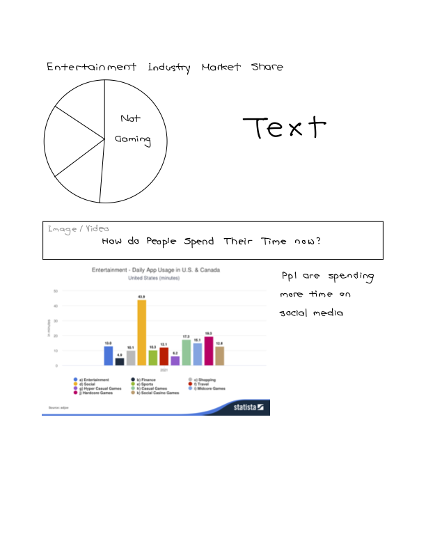

# Final project Overview

## Part I

### Outline 

I spend much of my free time playing video games on Switch and PS5 with my friends. Therefore, for this project, I intend to study and visualize data about video games. 

Gaming has evolved to become a multibillion-dollar market today. In my project, I would visualize the trend of global/regional video game sales (line chart), correlation of video game score and sales (scatter plot), and how much of total sales games from each genre/platform/publisher makes up (bar chart, pie chart, stacked area graph, bubble chart, heatmaps, etc.). I hope the audience can have a better sense of how the gaming market evolves, and what games are most popular after reading my story. I also hope to discover some good games as well ^_^

### Initial Sketches

I will use a line chart to show trend in global/regional video game sales. The header will be "Global/Regional Video Game Sales in Millions". The x-axis is year and the y-axis is sales.

I will use a scatter plot to draw the correlation of video game score and sales. The header will be "Video Game Score V.S. Sales". The x-axis is score and the y-axis is sales. There are two sets of scores (critic score and user score) for each game. I will use yellow points to represent user score, green points to represent critic score.

The next visualization is on the proportion of total sales games from each genre/platform/publisher makes up. The header will include the most popular genre/platform/publisher. I can use a bubble chart, where the size of the bubble represents the proportion. A bar chart, pie chart or stacked area chart, where the length, proportion or area represents how much the category makes up in the total sales. I could also use a heat map, where the axises are genre/platform/publisher, and color of different saturation representing sales.

### Data

Source: https://data.world/sumitrock/video-games-sales

The data is from data.world. It contains the platform, year of release, genre, publisher, global/regional sales, and score of 16719 games. 

### Method and Medium
I will build the graphs and plots using Tableau and Flourish. The story will be built using Shorthand. It will consist of approximately three to five graphs.

### References
Video games sales - dataset by sumitrock. data.world. (2019, December 29). Retrieved September 26, 2022, from https://data.world/sumitrock/video-games-sales 

## Part II

### Wireframes and storyboards
See below for data visualization drafts in the wireframe (graph 1, 2, 3, and the last graph) 

### Data Visulization Drafts

##### Graph 1

##### Graph 2

##### Graph 3

##### Last graph
This is the origianl chart from the Statistica website. I'll reorder the bar chart by length in my storyboard.

### User research and interviews

**Target audience**: people who want to learn about entertainment trends

**Approach to identifying representative individuals to interview**: The target audience of this story is not hard to find. My interviewees are three graduate students who are interested in learning about entertainment trends. The critique group from class algo gave me some feedback.

**Interview script and findings**:

**What are your first impressions after reading through the storyboard?**

Some of the interviewees said they did not realize the purpose of the storyboard is to show changes in people's entertainment until they've reached the last section. They also thought flow of the story needs more explanation. 

**Is there anything you like/dislike?**

They thought the graphs were nice but lacked explanation. They were hoping for better subtitles, texts, and annotations in the graph that could guide them through the story. 

**What other things would you like to see or change?**

A chart on how people used to spend their time in the first section would help people get the idea that it's showing peoples are playing less video games and more onto other entertainme methods, such as social media. For graph 2, if the goal is to show people are playing less video games, a vertical bar chart with year on the x-axis would make more sense. 

**What did you take away?**

People are spending more of their leisure time on social media, compared to video games. 

### Revised Wireframes and storyboards
The story board starts with showing people gaming was once the largest sector in the entertainment business, whose sales were gradually shrinking. The next two sections are on other types of entertainments rising and peoples spending more time on these areas.

##### Revised section 1
Adding a pie/chart to the first section to give background on how people used to spend their time on entertainment.

##### Revised graph 2
Add a line under the title to explain the size of the bubble chart is proportional to global sales of video games in the genre.

##### Revised graph 2
Since the goal is to show people are spending less time playing video games, it is more interpretabe to make the stacked bar chart vertical.

##### Revised graph 3
Change the title from "Global Sales by Year" to "Is the Video Market Shrinking?" better reflects that people are playing video games less. 

### References
Video games sales - dataset by sumitrock. data.world. (2019, December 29). Retrieved September 26, 2022, from https://data.world/sumitrock/video-games-sales 

Perrin, A. (2020, May 30). Social Media Usage: 2005-2015. Pew Research Center: Internet, Science &amp; Tech. Retrieved October 3, 2022, from https://www.pewresearch.org/internet/2015/10/08/social-networking-usage-2005-2015/ 

Entertainment - united states. Statista. (n.d.). Retrieved October 4, 2022, from https://www.statista.com/outlook/dmo/app/entertainment/united-states#users 

[Return to Homepage](/README.md)
